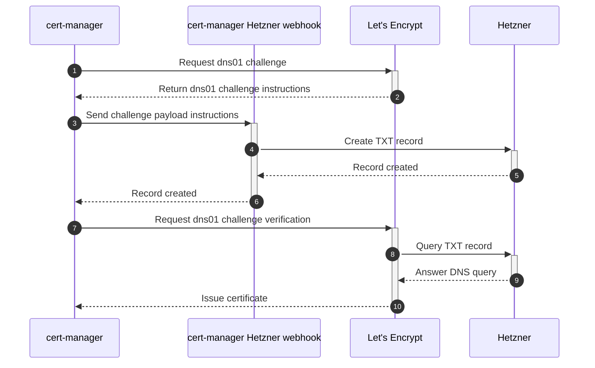

# Architecture

This document describes the architecture of the cert-manager webhook Hetzner.

## DNS01 challenge flow

The figure below depicts the flow of a DNS01 challenge when using the cert-manager webhook Hetzner with Lets Encrypt as a certificate issuer.

After creating the necessary Kubernetes resources to trigger a certificate request, cert-manager will initialize a dns01 challenge request at Lets Encrypt. The response contains a challenge payload, which needs to be placed inside a TXT record. This done by the `cert-manager-webhook-hetzner`, which creates a RRSet of type TXT with the necessary records at the Hetzner Cloud API. The RRSet is named after the requested DNS entry with the prefix `_acme-challenge`. Lets Encrypt will try to verify the certificate request by querying the domain name system for the corresponding record.

